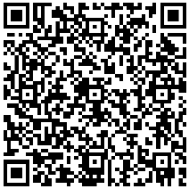

QSL QR-Code Documentation
=========================

Version 0 (2017-09-19)

The following text is extracted from the document
LA17_C3_47 DARC - QR Code on QSL Cards,
Annex A: QSL QR-Code Documentation, pp. 3-8.
In the initial revision of this file, no modifications were made to the
original text except for:
- Markdown formatting, and
- insertion (repetition) of table head lines in the last section.

The version described in LA17_C3_47 was piloted in the DARC QSL office.

Some tables in this specification are based on enumerations defined
in the ADIF specification.

---

 
*Figure 1: qrcode: [https://en.wikipedia.org/wiki/QR_code](https://en.wikipedia.org/wiki/QR_code)*

QR Code:

QR codes are offered in different versions, which differ in the size, number
of modules and the storage space they provide. We have determined a memory
space requirement of 189 characters for our data packet for a maximum of six
QSOs, whereby the developed dynamic format can be extended via additional data
fields within the available storage space. A redundancy of data for error
correction is included in the QR code.

The following QR-Code is used for QSL-coding: 
Version 10, Correction Level Q (25%), 221 alphanumerical characters

Description of the data package

The data packet is divided into the header and the QSO part, with the header
and QSO part again divided into fixed and variable parts.

- Head
  - Fixed part
  - Variable part
- QSO 1
  - Fixed part
  - Variable part
- QSO 2
  - Fixed part
  - Variable part

  (and so on up to)
- QSO 6
  - Fixed part
  - Variable part

Head fixed part:

The only two fixed addresses in the data packet are address 0x000 and
address 0x004. At the address 0x000 there are four characters (valid
from 0x0 to 0xF) which represent a 16-bit integer value, where the least
significant bit is last (LSB) and the significance represents the version
of the code. By altering the version later, this code is future proof,
because it can be extended at any time for any other format.

The second address 0x004 is the starting address for the actual data of
the packet. This is where the non-optional part starts. The first byte
contains the length of the OPERATOR, followed by the string of the OPERATOR.

| Sign    |  0  |  0  |  0  |  1  |  5  |  D  |  L  |  1  |  J  |  B  |
|:--------|:----|:----|:----|:----|:----|:----|:----|:----|:----|:----|
| Address | 0x00| 0x01| 0x02| 0x03| 0x04| 0x05| 0x06| 0x07| 0x08| 0x09|

*Table 1: The Version this code is 1 and the senders call sign (OPERATOR)
          is DL1JB*

Further mandatory fields include CALL and QSL_VIA. After the mandatory fields,
the values of size for the following variable part (UINT8) are placed. This size
is read in and the attached character string is processed for the number of
characters read. If the value is zero, there is no other variable data to read.

| Sign    |  0  |  0  |  0  |  1  |  5  |  D  |  L  |  1  |
|:--------|:----|:----|:----|:----|:----|:----|:----|:----|
| Address | 0x00| 0x01| 0x02| 0x03| 0x04| 0x05| 0x06| 0x07|
| Sign    |  J  |  B  |  5  |  D  |  J  |  6  |  C  |  A  |
| Address | 0x08| 0x09| 0x0A| 0x0B| 0x0C| 0x0D| 0x0E| 0x0F|
| Sign    |  5  |  D  |  L  |  7  |  G  |  B  |  3  |  3  |
| Address | 0x10| 0x11| 0x12| 0x13| 0x14| 0x15| 0x16| 0x17|

*Table 2. CALL is here DJ6CA, VIA is DL7GB. The length of the
          following variable is 51 (0x33)*

Head variable part

The structure of the data in the variable part follows a specific scheme,
whereby a code (UINT8) always indicates which data field follows.

For the data type STRING the next data filed is used for the length of the
data followed by the actual data. For all other data types, there is no length
specification and the actual data follows immediately afterwards.

| Sign    |  0  |  0  |  3  |  U  |  L  |  M  |
|:--------|:----|:----|:----|:----|:----|:----|
| Address | 0x18| 0x19| 0x1A| 0x1B| 0x1C| 0x1D|

*Table 3: Code is 0 (QTH), the data type is STRING with a length of 3
          and the value for the QTH is „ULM“*

| Sign    |  0  |  1  |  6  |  7  |
|:--------|:----|:----|:----|:----|
| Address | 0x1E| 0x1F| 0x20| 0x21|

*Table 4: Code is 1 (AGE), the data type is UINT8 and
          the value for the AGE is 103 (0x67)*

Basic structure of variable data:

- data type UINT8, UINT16, UINT32:
  - <XX> Code (UINT8), <XX??????> 2, 4 or 8 characters from 0x0 to 0xE.
- data type STRING:
  - <XX> Code (UINT8), <X> number of signs (NIBBLE), <X*> data (STRING)
- data type DATETIME:
  - <XX> Code (UINT8), <XXXXXXXX> Date and time as unix timestamp.

QSO fixed part:

For the fixed part of each QSO, a total of five fields are mandatory:
OPERATING MODES (UINT8), BAND (UINT8), DATETIME (DATETIME), RAPPORT (STRING),
and QSL (NIBBLE).

| Sign    |  0  |  A  |  1  |  1  |  5  |  8  |  A  |  0  |
|:--------|:----|:----|:----|:----|:----|:----|:----|:----|
| Address | 0x22| 0x23| 0x24| 0x25| 0x26| 0x27| 0x28| 0x29|
| Sign    |  6  |  4  |  B  |  5  |  2  |  5  |  9  |  Y  |
| Address | 0x3a| 0x3b| 0x3c| 0x3d| 0x3e| 0x3f| 0x40| 0x41|

*Table 5: Mode is 10 (FM), Band is 17 (70cm), Date and Time:
          2017-02-12 14:35:49, Rapport is 59 and QSL is Y*

QSO variable part:

The principle of how data is encoded in the variable part of the QSOs follows
the same scheme as for coding in the variable header. First the length (UINT8)
of the variable part and afterwards the data fields itself (see head variable
part).

Data Types:

The number of characters for the data type STRING is limited to 15. The number
of characters is always pre-set.

The value range for the NIBBLE data type is from 0-15.
The value range for the data type UINT8 is from 0-255.
The value range for data type UINT16 is from 0-65535.
The value range for the data type DATETIME 1970-01-01 00:00:00 to 19 January
2038-01-19 03:14:08 (8 signs)

Tables:

Additional fields:

| Code | field name   | data type code | data type |
|:-----|:-------------|:---------------|:----------|
|    0 | QTH          | 3              | STRING    |
|    1 | AGE          | 4              | UINT8     |
|    2 | A_INDEX      | 4              | UINT8     |
|    3 | ANT_AZ       | 4              | UINT8     |
|    4 | ANT_EL       | 4              | UINT8     |
|    5 | CHECK        | 4              | UINT8     |
|    6 | CLASS        | 3              | STRING    |
|    7 | COMMENT      | 3              | STRING    |
|    8 | CONTACTED_OP | 3              | STRING    |
|    9 | CONTEST_ID   | 3              | STRING    |
|   10 | COUNTRY      | 4              | UINT8     |

*Table 6: Excerpt from fields.csv*

Bands:

| Code | Band    | Lower Freq (MHz) | Upper Freq (MHz) |
|:-----|--------:|-----------------:|-----------------:|
|    0 |  2190 m |        0.1357    |        0.1378    |
|    1 |   630 m |        0.472     |        0.479     |
|    2 |   560 m |        0.501     |        0.504     |
|    3 |   160 m |        1.8       |        2.0       |
|    4 |    80 m |        3.5       |        4.0       |
|    5 |    60 m |        5.102     |        5.4065    |
|    6 |    40 m |        7.0       |        7.3       |
|    7 |    30 m |        10.100    |       10.150     |
|    8 |    20 m |        14.0      |       14.35      |
|    9 |    17 m |        18.068    |       18.168     |
|   10 |    15 m |        21.0      |       21.45      |
|   11 |    12 m |        24.890    |       24.990     |
|   12 |    10 m |        28.0      |       29.7       |
|   13 |     6 m |        50        |       54         |
|   14 |     4 m |        70        |       71         |
|   15 |     2 m |       144        |      148         |
|   16 |  1.25 m |       222        |      225         |
|   17 |   70 cm |       420        |      450         |
|   18 |   33 cm |       902        |      928         |
|   19 |   23 cm |      1240        |     1300         |
|   20 |   13 cm |      2300        |     2450         |
|   21 |    9 cm |      3300        |     3500         |
|   22 |    6 cm |      5650        |     5925         |
|   23 |    3 cm |     10000        |    10500         |
|   24 | 1.25 cm |     24000        |    24250         |
|   25 |    6 mm |     47000        |    47200         |
|   26 |    4 mm |     75500        |    81000         |
|   27 |  2.5 mm |    119980        |   120020         |
|   28 |    2 mm |    142000        |   149000         |
|   29 |    1 mm |    241000        |   250000         |

Modes:

| Code | Mode            |
|:----:|:---------------:|
|   0  | AM              |
|   1  | ATV             |
|   2  | CHIP            |
|   3  | CLO             |
|   4  | CONTESTI        |
|   5  | CW              |
|   6  | DIGITALVOICE    |
|   7  | DOMINO          |
|   8  | DSTAR           |
|   9  | FAX             |
|  10  | FM              |
|  11  | FSK441          |
|  12  | HELL            |
|  13  | ISCAT           |
|  14  | JT4             |
|  15  | JT6M            |
|  16  | JT9             |
|  17  | JT44            |
|  18  | JT65            |
|  19  | MFSK            |
|  20  | MT63            |
|  21  | OLIVIA          |
|  22  | OPERA           |
|  23  | PAC             |
|  24  | PAX             |
|  25  | PKT             |
|  26  | PSK             |
|  27  | PSK2K           |
|  28  | Q15             |
|  29  | ROS             |
|  30  | RTTY            |
|  31  | RTTYM           |
|  32  | SSB             |
|  33  | SSTV            |
|  34  | THOR            |
|  35  | THRB            |
|  36  | TOR             |
|  37  | V4              |
|  38  | VOI             |
|  39  | WINMOR          |
|  40  | WSPR            |

*Table 8: Excerpt from modes.csv*

Definitions:

Fields

 - i.e. the Operator: not optional, address: 0x05, data type: string,
   max length 14, variable length;
 - i.e. QTH: optional, address: variable, data type: string, max length: 10,
   variable length, code: 1

Codes

 - i.e. 1, code for the QTH, head data

Packet

 - the content of "qrcode"

Address

 - the byte number in the stream. For "teststring", address 1 would be
   an "e" and address 7 would be an "i".

Calculation of the maximum size for a minimally configured package:

Head:

| Number of max. Signs | Field/part                  |
|---------------------:|:----------------------------|
|          4           | Version                     |
|          1+14        | length + Operator           |
|          1+14        | length + Call               |
|          1+14        | length + Qsl_via            |
|          2           | length variable part        |
|                      |                             |
|         51           | Sum                         |

QSOs: 		

| Number of max. Signs | Field/part                  |
|---------------------:|:----------------------------|
|          2           | mode                        |
|          2           | band                        |
|          8           | datetime                    |
|          1+7         | length + rapport            |
|          1           | qsl                         |
|          2           | length variable part        |
|                      |                             |
|         23           | Sum per QSO                 |
|        138           | for 6 QSOs                  |

| Number of max. Signs | Field/part                  |
|---------------------:|:----------------------------|
|         51           | head                        |
|       +138           | for 6 QSOs                  |
|                      |                             |
|       *189*          | *Sum*                       |

